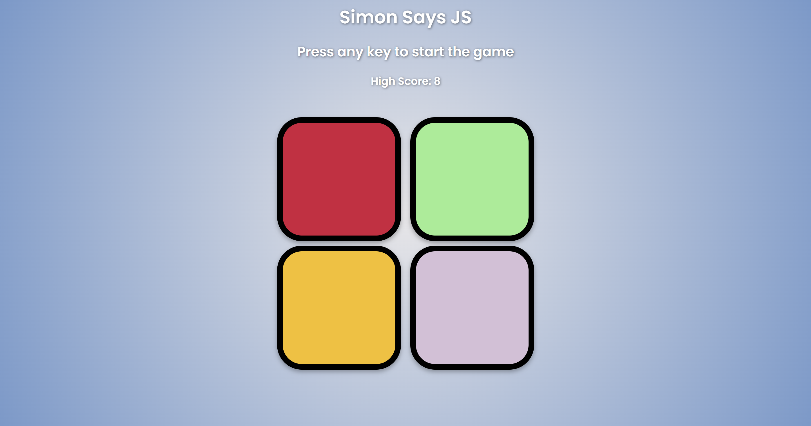
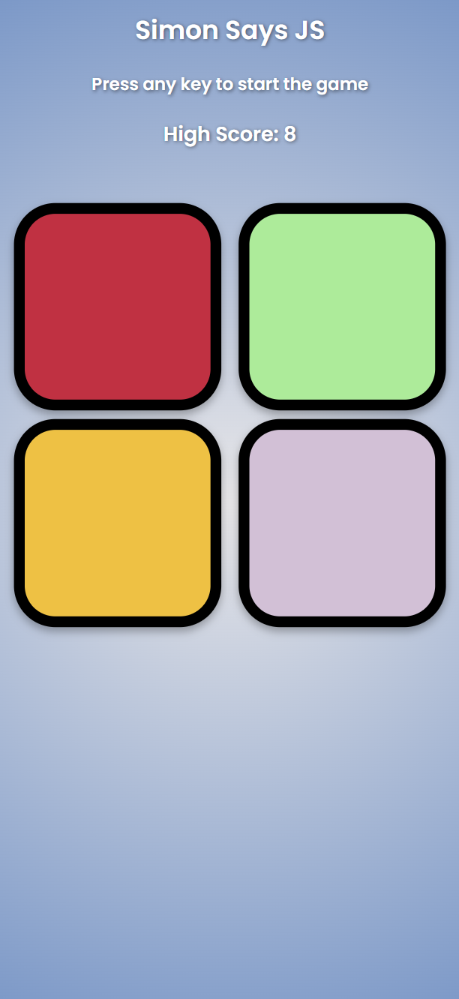

# 🧠 Simon Says JS

A fun and colorful **memory game** built using **HTML**, **CSS**, and **JavaScript**!  
Challenge your brain by remembering and repeating the growing sequence of colors. 🎨🧠

---

## 🎯 Project Overview

This project is a modern, mobile-responsive version of the classic **Simon Says** memory game.  
It was built to sharpen front-end development skills such as **DOM manipulation**, **event handling**, **dynamic styling**, and **basic game logic**.

---

## 🚀 Live Demo

👉 [Play Simon Says JS Live Here](https://bhupeshk3014.github.io/simonsays-js/)

---

## 🛠️ Features

- 🎨 Colorful animated buttons
- 🧠 Random sequence generation
- 📈 Dynamic level progression
- ❌ Smooth Game Over effect
- 🔊 Button click and error sounds
- 🏆 Local storage high score saving
- 📱 Mobile responsive design
- ✨ Smooth level text fade transitions
- 🖥️ Clean, modern UI using Google Fonts and CSS Flexbox

---

## 📂 Tech Stack

- **HTML5** — Markup structure
- **CSS3** — Styling and animations
- **JavaScript (Vanilla)** — Game logic and DOM interactions
- **Google Fonts** — Clean and modern typography
- **LocalStorage API** — Saving high scores

---

## 🎮 How to Play

1. Press any key to start the game.
2. Watch carefully as the game flashes a random color.
3. Click the buttons in the exact same sequence.
4. Each new level adds an extra color to the sequence.
5. Make a mistake? Game over! Your score will be displayed.
6. Try again to beat your **High Score**! 🏆

---

## 📸 Screenshots

| Desktop View | Mobile View |
|:---:|:---:|
|  |  |

---

## 📦 How to Run Locally

1. Clone the repository:
   ```bash
   git clone https://github.com/bhupeshk3014/simonsays-js.git

2. Navigate into the project folder:
   ```bash
   cd simonsays-js

3. Open index.html in your browser.

## Acknowledgements

1. Inspired by the classic "Simon Says" game concept.
2. Built with ❤️ to enhance JavaScript and front-end skills.